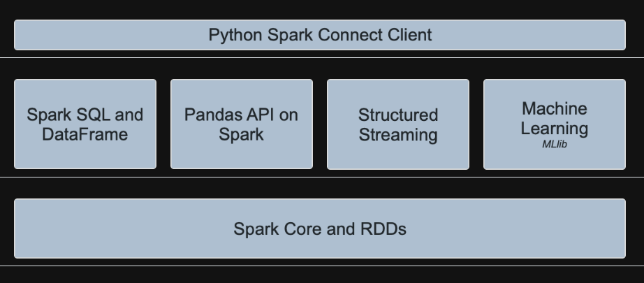

# Basics

https://spark.apache.org/docs/latest/api/python/index.html

PySpark supports all of Spark’s features such as Spark SQL, DataFrames, Structured Streaming, Machine Learning (MLlib), Pipelines and Spark Core.

## 1. Python Spark Connect Client

Spark Connect is a client-server architecture within Apache Spark that enables remote connectivity to Spark clusters from any application. PySpark provides the client for the Spark Connect server, allowing Spark to be used as a service.

Pyspark also needs jvm, spark master and workers run their own jvm

`SparkSession.builder.master()`
This is the classic Spark API. It tells the Spark driver where to submit jobs.
The driver (your Python process) runs on your machine, connects to the Spark Master, and schedules tasks on the workers.

`SparkSession.builder.remote()` is newer and is used with Spark Connect.
Instead of embedding the Spark driver inside your Python process, your Python code becomes a thin client. The actual Spark driver runs remotely in a Spark Connect server.

Python in worker has different version: 3.10 than that in driver: 3.12, PySpark cannot run with different minor versions.
Please check environment variables PYSPARK_PYTHON and PYSPARK_DRIVER_PYTHON are correctly set
Pyspark driver python version and spark worker python version should be same

## 2. Spark SQL and DataFrames

## 3. Pandas API on Spark

## 4. Structured Streaming

## 5. Machine Learning (MLlib)

## 6. Declarative Pipelines

